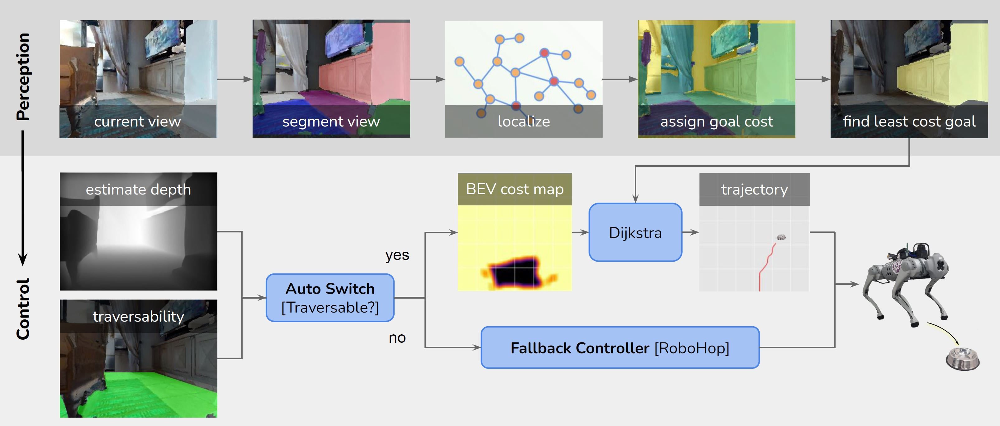
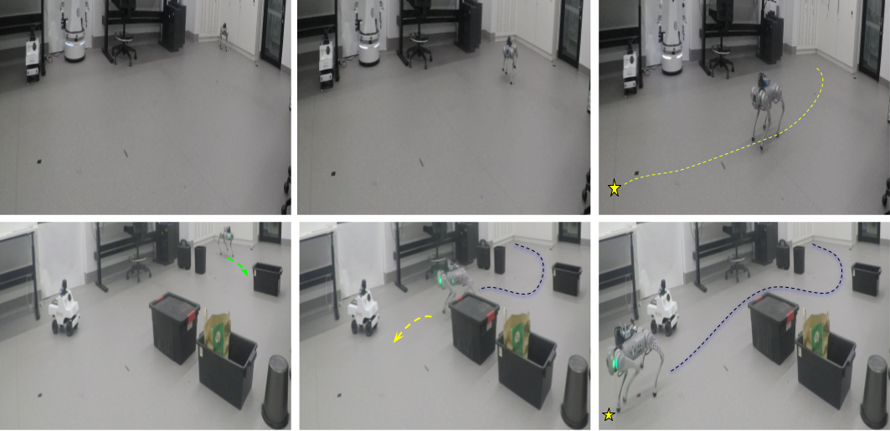

# TANGO: Traversability-Aware Navigation with Local Metric Control for Topological Goals [ICRA 2025]





This is the official implementation of the paper. Please refer to the [paper](https://github.com/podgorki/TANGO/blob/master/data/ICRA2025-TANGO-Navigation.pdf) and 
[website](https://podgorki.github.io/TANGO/) for more technical details.

This repository contains the TANGO controller and a minimal setup required to show the demo on habitat-sim. 

This work is based off a larger project beginning with RoboHop and the full evaluation for this code and Robohop can be 
found at [website](...) 

## Results
<div align="center">
  <div style="max-width: 800px;">
    <table align="center" width="80%">
      <caption>
        Navigation success rate across varying trajectory lengths.
      </caption>
      <thead>
        <tr>
          <th>Controller</th>
          <th>Easy [1–3m]</th>
          <th>Hard [3–5m]</th>
          <th>Full [8–10m]</th>
        </tr>
      </thead>
      <tbody>
        <!-- GT‑Metric block -->
        <tr>
          <td colspan="4" align="center"><strong>GT‑Metric</strong></td>
        </tr>
        <tr>
          <td>RoboHop[1]</td>
          <td align="right">93.14</td>
          <td align="right">78.43</td>
          <td align="right">42.16</td>
        </tr>
        <tr>
          <td>PixNav[2]</td>
          <td align="right">65.69</td>
          <td align="right">44.12</td>
          <td align="right">15.69</td>
        </tr>
        <tr>
          <td><strong>Ours (TANGO)</strong></td>
          <td align="right"><strong>94.12</strong></td>
          <td align="right"><strong>90.20</strong></td>
          <td align="right"><strong>48.04</strong></td>
        </tr>
        <!-- GT‑Topological block -->
        <tr>
          <td colspan="4" align="center"><strong>GT‑Topological</strong></td>
        </tr>
        <tr>
          <td>RoboHop[1]</td>
          <td align="right">78.43</td>
          <td align="right">58.82</td>
          <td align="right">25.49</td>
        </tr>
        <tr>
          <td>PixNav[2]</td>
          <td align="right">60.78</td>
          <td align="right">44.12</td>
          <td align="right">15.69</td>
        </tr>
        <tr>
          <td><strong>Ours (TANGO)</strong></td>
          <td align="right">74.51</td>
          <td align="right"><strong>65.69</strong></td>
          <td align="right"><strong>30.39</strong></td>
        </tr>
        <!-- No‑GT block -->
        <tr>
          <td colspan="4" align="center"><strong>No‑GT</strong></td>
        </tr>
        <tr>
          <td>RoboHop[1]</td>
          <td align="right">43.56</td>
          <td align="right">34.56</td>
          <td align="right">13.73</td>
        </tr>
        <tr>
          <td>PixNav[2]</td>
          <td align="right">51.96</td>
          <td align="right">39.22</td>
          <td align="right">14.00</td>
        </tr>
        <tr>
          <td><strong>Ours (TANGO)</strong></td>
          <td align="right"><strong>61.76</strong></td>
          <td align="right"><strong>43.14</strong></td>
          <td align="right"><strong>21.57</strong></td>
        </tr>
      </tbody>
    </table>
  </div>
</div>

[1] RoboHop-Garg S. et al., Robohop: Segment-based topological map representation for open-world visual navigation ICRA 2024.

[2] PixNav-Cai et al., Bridging zero-shot object navigation and foundation models through pixel-guided navigation skill, CVPR 2024


## Installation 

Clone this repo - recursive is required for Depth Anything
```commandline
git clone --recursive https://github.com/podgorki/TANGO.git
cd TANGO
```

### Create new environment

```commandline
python3.10 -m venv .venv --prompt tango
source .venv/bin/activate
python -m pip install --upgrade pip setuptools wheel
```

## Install controller and sim (required for demo)

### Pre-install habitat-sim

#### Dependencies
```commandline
sudo apt-get install -y --no-install-recommends libjpeg-dev libglm-dev libgl1-mesa-glx libegl1-mesa-dev mesa-utils xorg-dev freeglut3-dev
pip install cmake==3.14.4
pip install "numpy>=1.25,<2" --upgrade  # required before building habitat-sim
```

#### Clone and build the Sim (takes a bit)
```commandline
cd third-party/
git clone https://github.com/facebookresearch/habitat-sim.git
cd habitat-sim/
git checkout v0.2.4
python setup.py install --cmake
cd ../..
```

### Install TANGO

```commandLine
pip install -e ".[habitat-lab]" --extra-index-url https://download.pytorch.org/whl/cu128 --prefer-binary
``` 

### Depth anything
Depth anything is installed by submoduling.

Add a pth so you can resolve zoedepth
```commandline
echo "$PWD/third_party/depth_anything/metric_depth" > \
     $(python -c "import site, sys; print(site.getsitepackages()[0])")/zoedepth_local.pth
```

The depth anything model weights are located at: https://huggingface.co/spaces/LiheYoung/Depth-Anything/tree/main/checkpoints_metric_depth
And also grab the vit from here https://huggingface.co/spaces/LiheYoung/Depth-Anything/tree/main/checkpoints
place them in third_party/models/

## TANGO Demo
Download official [hm3d v0.2](https://github.com/matterport/habitat-matterport-3dresearch) following their instructions. Place (or synlink) it at `./data/`.

Unzip test data: `unzip data/hm3d_iin_val.zip -d ./data/`

```commandline
python -m scripts.run_goal_control_demo
```

## BibTex
Please cite our paper if you find it helpful :)
```
@inproceedings{podgorski2025tango,
  title={TANGO: Traversablility-Aware Navigation with Local Metric Control for Topological Goals},
  author={Podgorski, Stefan and Garg, Sourav and Hosseinzadeh, Mehdi and Mares, Lachlan and Dayoub, Feras and Reid, Ian},
  booktitle={2025 IEEE International Conference on Robotics and Automation (ICRA)},
  year={2025},
  organization={IEEE}
}
```
